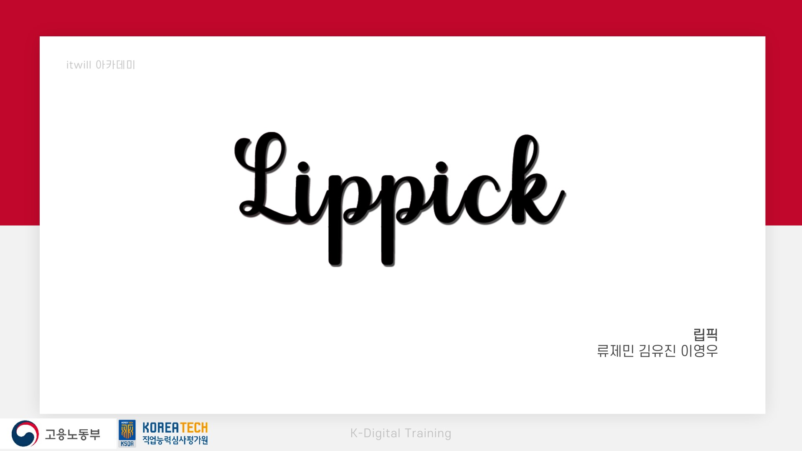
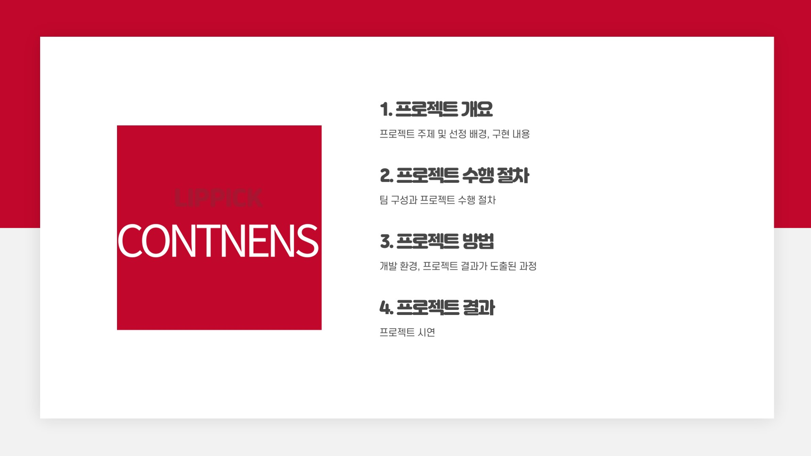
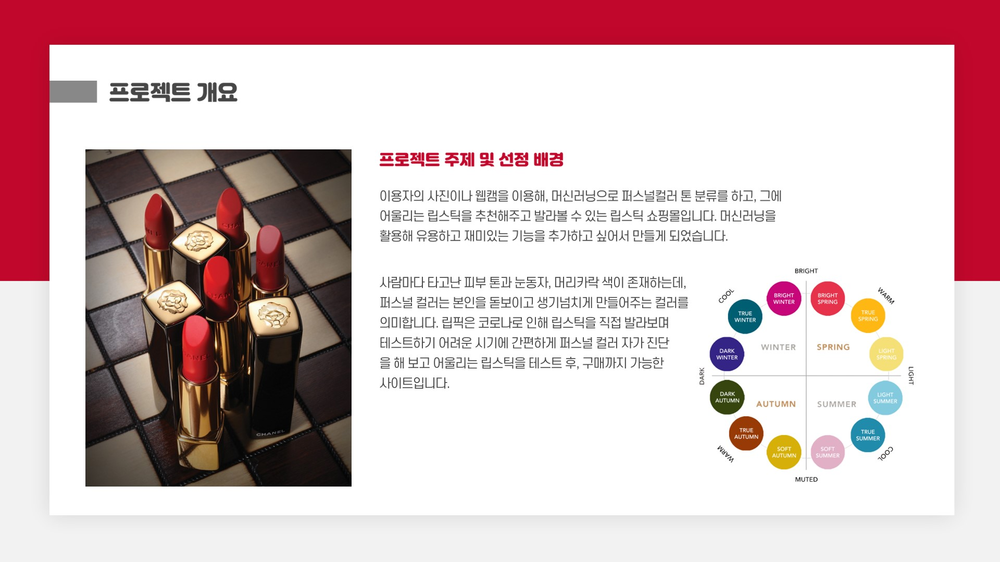
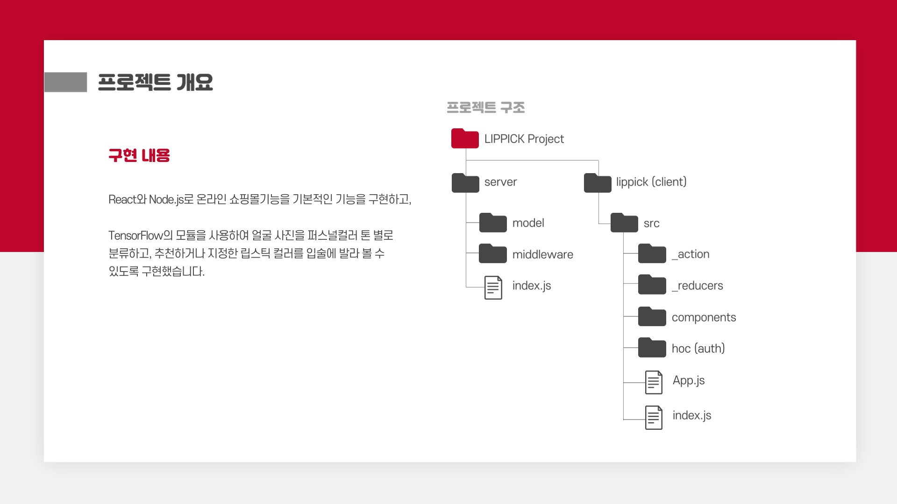
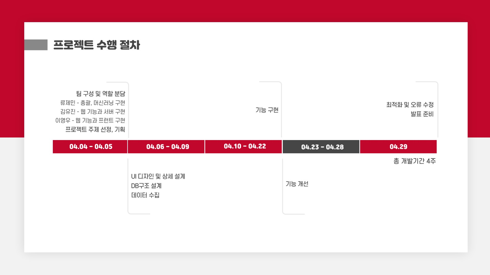
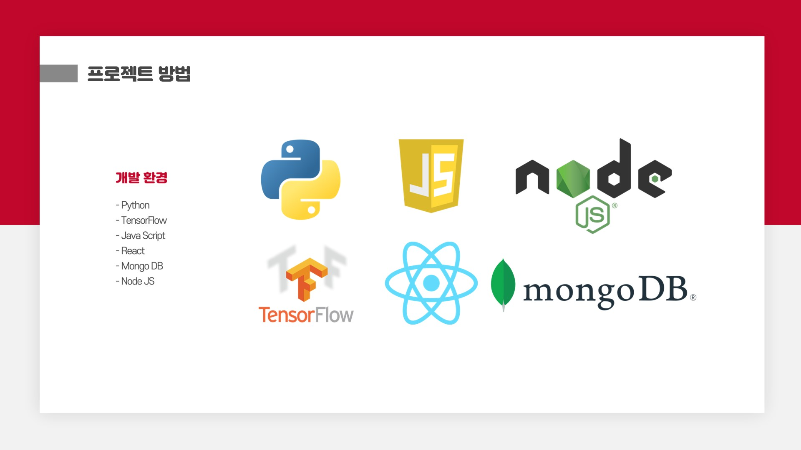
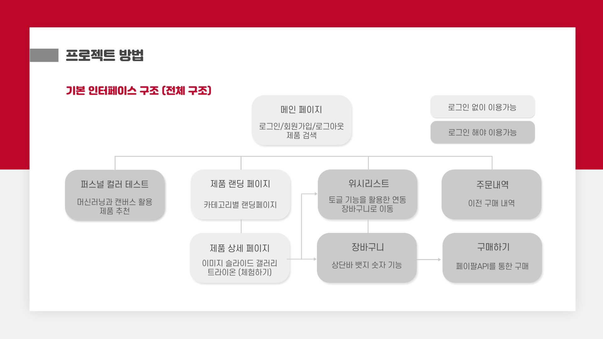
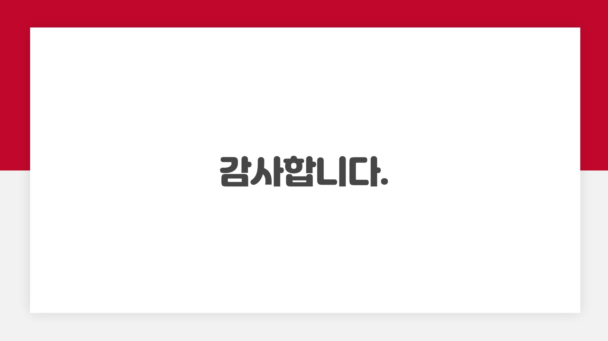

React, Node.js 기반의 웹 페이지입니다.
=================================

<pre>
● 기간 2022.04.04 ~ 2022.04.29 / 3인 프로젝트
● 국비교육학원에서 2차 팀프로젝트로 진행한 프로젝트입니다. 
● 국비교육학원 2차 팀프로젝트 발표회에서 최우수상을 수상하였습니다.
● 한국소프트웨어산업협회 주관의 벤처 스타트업 아카데미 통합 프로젝트 발표회에서 최우수상을 수상하였습니다.
● 3명의 팀원이 개발 프로세스를 응용하여 협업하였습니다.
● 저는 프론트엔드를 맡았습니다.
</pre>

프로젝트 소개
------------

</img> 
</img> 
</img> 
</img> 
</img> 
</img> 
</img> 
</img> 
